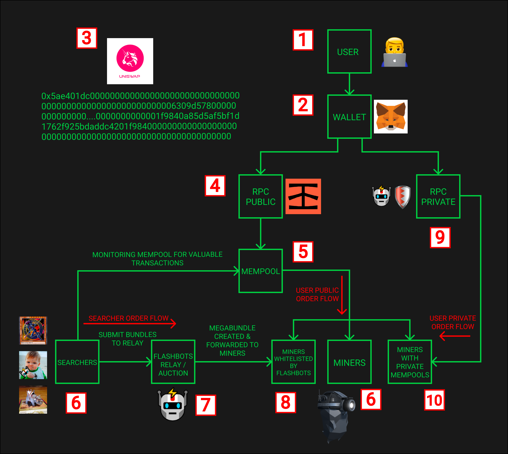
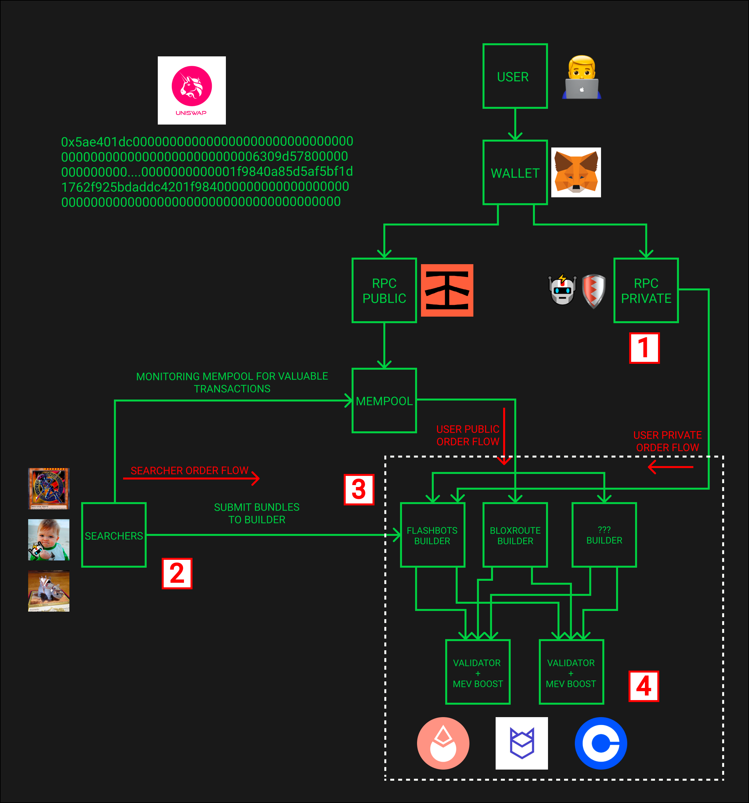
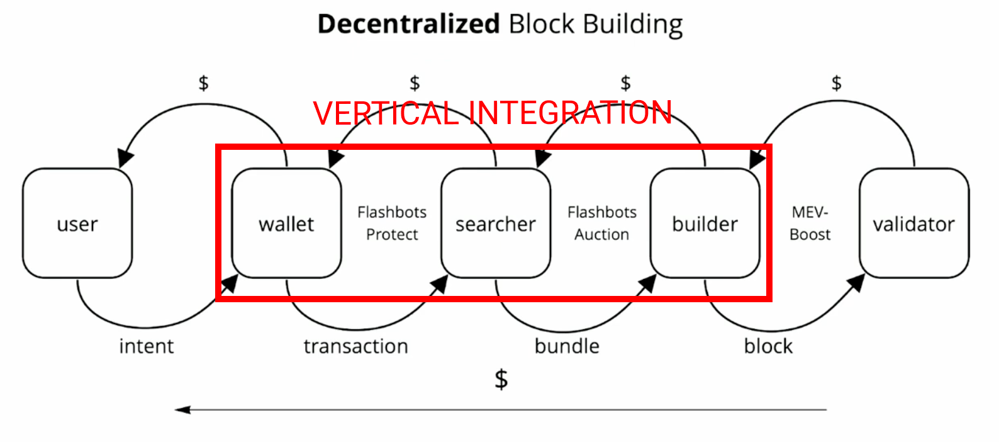

### 术语
* 共识层客户端 (consensus client)：负责以太坊权益证明共识的客户
* 执行层客户端 (execution client)：负责以太坊虚拟机执行的客户端
* 内存池（mempool）：内存池（交易池）是一组以太坊交易，这些交易已经广播到网络并等待被挖掘成一个区块
* 执行负载 (execution payload)：包含未被签名的执行负载的完整内容的消息，这个消息会被添加到一个信标区块中
* 中间件 (middleware)：在共识层客户端和执行层客户端中间的一个新软件，它与中继相连
* 矿工（miner）：以太坊使用POW共识协议时，集合构建者和提议者的功能与一身的角色
* 提议者 (proposer)：对进入网络的信标区块进行签名和提交的一方，通常被称为验证者
* 用户 (user)：发送交易的普通以太坊用户
* 搜索者 (searcher)：高阶以太坊用户，专门寻找 MEV 机会和发送交易捆这样的高级交易类型
* 构建者 (builder)：专门用从用户和搜索者接收到的交易构建以太坊执行负载的一方 (搜索者和用户信任其会公平打包)
* 中继 (relay)：专门从事 DoS 保护和网络连接的一方，它们验证和路由执行负载给区块提议者 (构建者信任其会进行公平的路由，提议者信任其路由的负载具有区块有效性、准确性和数据可用性)
* 第三方托管 (escrow)：负责为提议的执行负载提供冗余的数据可用性的一方 (中继信任其提供的数据隐私性)

### 什么是MEV
* MEV 是 Miner Extractable Value 的缩写，即矿工可提取价值，矿工们会根据 gas 费用的高低来决定交易顺序，从而获取更大的利润；MEV 的产生是因为交易被发送到网络到交易信息被打包至区块之间存在延迟。当前在MEV的分配链条上已经出现的明确的分工，不仅仅最初简单的矿工所属，而且以太坊在从POW转向POS的过程中，EVM的分配方式也发生新的变化。

### POW MEV

* 交易从发送到网络到交易信息被打包至区块之间有三种路径, 显然方式一和方式三延迟更低，所以有了套利空间存在。特别是方式三，就是套利机器人的重灾区；常见 front-running，back-running，sandwiching。
方式一. 钱包配置私有节点，交易发送到私有交易池，专门矿工打包上链（user private order flow）
方式二. 使用公共节点，交易发送到公共交易池，矿工竞争打包上链（user public order flow）
方式三. 搜索者获取有价值的交易，经过 FlashBots的Auction，发送给中继，中继将其路由自己合作的矿工，打包上链（searcher order flow）

* 生态上的 searcher 一般有以下几类
1. 寻求快速、无风险访问区块空间的以太坊机器人运营商（例如，套利和清算机器人）
2. 寻求交易抢先保护的以太坊用户（Uniswap 交易者）
3. 具有高级用例的以太坊 Dapps，例如 Tornado.cash

### Flashboots

### POS MEV

* PBS（Proposer Builder Separation）提议构建者分离

### MEV supply chain

### 参考链接
1. [Welcome to Flashbots](https://docs.flashbots.net/flashbots-auction/overview)
2. [用于合并的 Flashbots 架构MEV-Boost及其实现计划](https://www.ethereum.cn/Technology/mev-boost-merge-ready-flashbots-architecture)
3. [Order Flows: Kingmaker of the Block Builders ](https://noxx.substack.com/p/order-flows-kingmaker-of-the-block)
